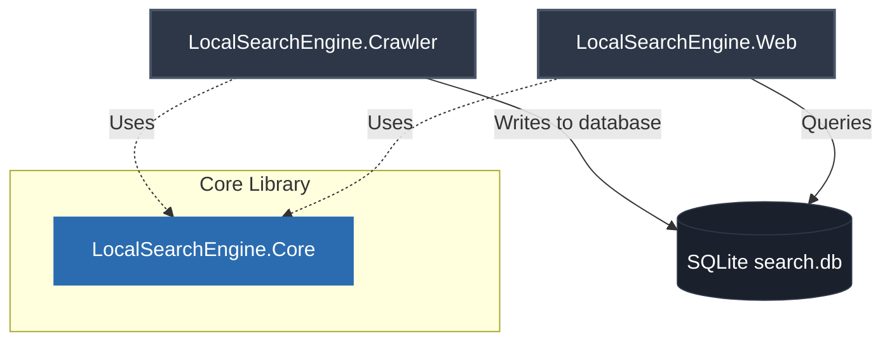

# Introduction

**LocalSearchEngine** is a fully self-hosted, local search platform built with C# and .NET. It allows you to build a local semantic and keyword search engine over websites, web pages, and documents on your local machine. 

All operations — crawling, text extraction, local AI vector embeddings, and ranking — run locally. Your data never leaves your machine.

---

## Architectural Overview

The project is structured into three main components:

1. **`LocalSearchEngine.Core`**: The backbone of the application. It contains the logic for network fetching, robots.txt exclusions, HTML/document parsing, text chunking, vector embedding, and hybrid search ranking.
2. **`LocalSearchEngine.Crawler`**: A console application wrapper around `Core` that manages the crawler frontier, performs the crawl loop, and outputs the index into a SQLite database.
3. **`LocalSearchEngine.Web`**: An ASP.NET Core web interface and REST API (`/api/search/query` and `/api/stats`) serving a hybrid search page.

---

## The Crawl Engine

The crawler is designed to build the index incrementally while being polite to the servers it visits:

### 1. Politeness by Design
* **`robots.txt` Compliance**: The crawler parses and adheres to `robots.txt` rules using `RobotsExclusionTools`, respecting longest-match precedence, bot-specific user-agent groups, and `Crawl-delay` directives (capped at 30 seconds).
* **Laziness**: Host configurations (robots.txt, sitemaps) are loaded lazily on the first request to that host.
* **Rate Limiting**: Requests to the same host are spaced by a minimum default delay of 250 milliseconds.

### 2. Incremental Crawls
To avoid re-indexing unchanged content:
* **Conditional HTTP Requests**: Sends `If-None-Match` (ETag) and `If-Modified-Since` (Last-Modified) headers.
* **Content Hashing**: A SHA-256 hash of the extracted page content is verified against previously indexed hashes. If identical, re-embedding is skipped.
* **Outlink Storage**: If a page is unchanged (304), the engine re-loads its previously discovered links from the database to keep traversing the site.

### 3. Page Directives
* **Meta robots**: Honors `<meta name="robots" content="noindex, nofollow">` tags and `X-Robots-Tag` headers.
* **Canonical URLs**: Resolves and follows `rel="canonical"` tags.
* **Error Handling**: 404/410 errors remove pages from the index, while transient 5xx errors leave previous versions intact to protect against temporary downtime.

### 4. Automatic Pruning
When a crawl drains its frontier naturally, it compares the visited URLs with the existing database. Any page within the crawl scope that was *not* encountered in the current run (meaning it was deleted, orphaned, or blocked by new robots rules) is automatically pruned from the index.

---

## Document Handling & Text Extraction

The engine processes files based on their actual **magic-byte signatures** rather than extension names, with one exception for Word documents (as `.docx` is technically a ZIP container, the extension is checked early to avoid downloading large unrelated archives).

* **HTML**: Boilerplate elements like `nav`, `footer`, `script`, `style`, and header links are stripped. Page-controls (inputs/buttons) are ignored, but ASP.NET or Oracle APEX pages wrapped in giant forms are parsed correctly.
* **PDFs**: Text is extracted utilizing `iText`, and metadata like document titles are extracted.
* **Word Documents**: Text is extracted utilizing `NPOI` for modern `.docx` files.

---

## Local AI & Hybrid Search

The search engine does not rely on cloud services like OpenAI or Cohere. Instead, it embeds and searches text entirely on your CPU:

* **Vector Embedding Model**: Bundles `snowflake-arctic-embed-s` (a 384-dimensional, quantized int8 model) powered by **ONNX Runtime**.
* **Vector Index**: Utilizes `sqlite-vec` (via Semantic Kernel) to perform local k-NN search using cosine similarity.
* **Keyword Index**: Utilizes SQLite's native **FTS5** virtual table with a Porter Stemming tokenizer for linguistic stemming (e.g. mapping "running" to "run").
* **Hybrid Search Ranker**: Ranks search results combining:
  1. Dense vector cosine similarity.
  2. Sparse keyword matching (verbatim and all-terms).
  3. Structural boosts (bonuses for keyword hits in titles, headings, and file names).